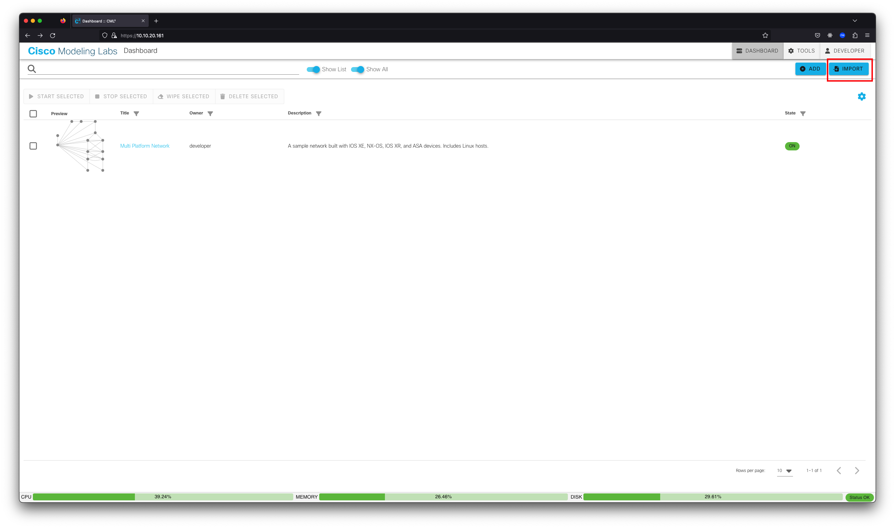
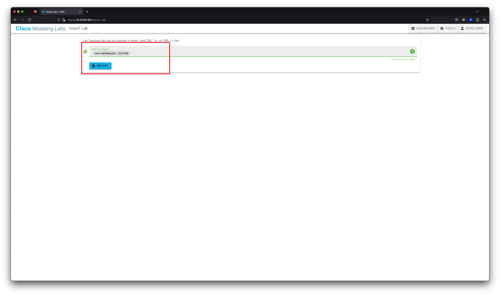
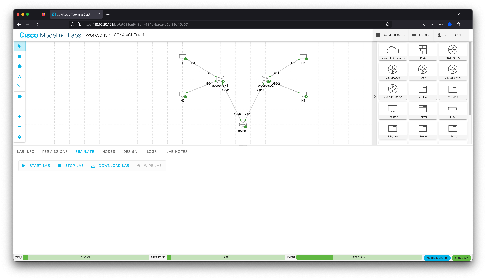

Before we get into the details, you will need some networking devices to play with. The easiest way to do this is to use a Cisco Modeling Labs server. If you don't have access to a Cisco Modeling Labs server, you can reserve and use a [DevNet Cisco Modeling Labs Sandbox](https://devnetsandbox.cisco.com/RM/Diagram/Index/5c964ff3-9d47-443a-90a9-971edf8fdb37). Assuming that you have access to a Cisco Modeling Labs server, you can import the [ccna-topology](ccna-topology.yaml) file into your Cisco Modeling Labs server and start the lab.

1. Log in to your Cisco Modeling Labs server web interface and click the **IMPORT** button.

2. Browse to find the network topology **ccna-topology.yaml** file downloaded for this lab. Click **IMPORT**, and then click **GO TO LAB**.

3. From the SIMULATE panel below the topology, click the **START LAB** button.

> **Note:** Be sure that you do not have any switches in the topology selected, or you'll only start that one node.

4. Wait for all nodes to get green check marks indicating that they are started. This process can take 1 to 5 minutes, depending on the Cisco Modeling Labs server's load.
